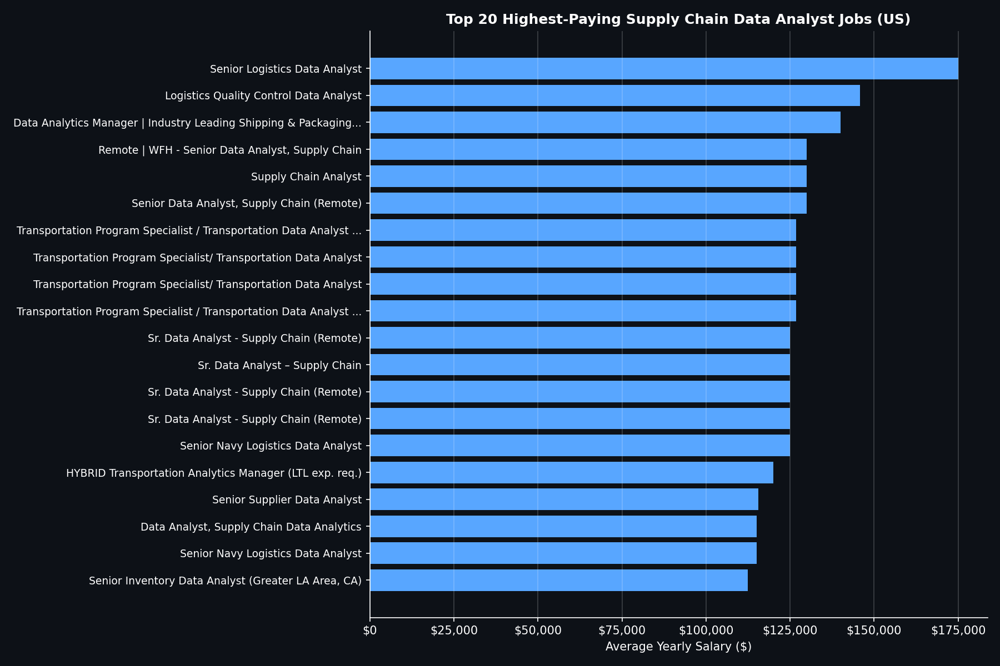
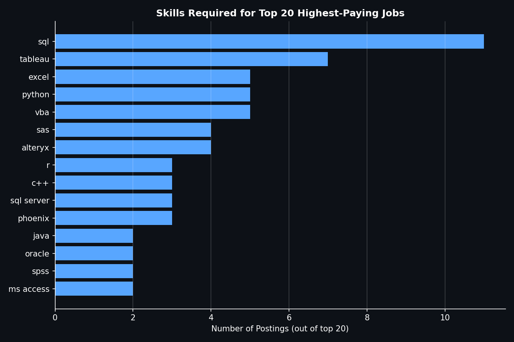
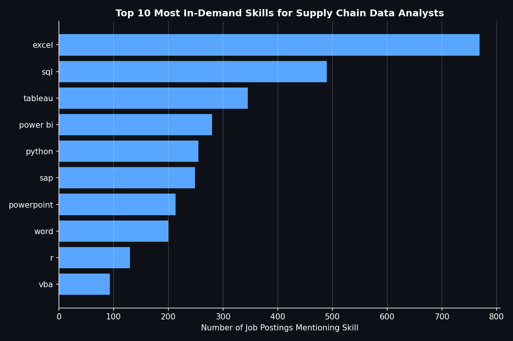
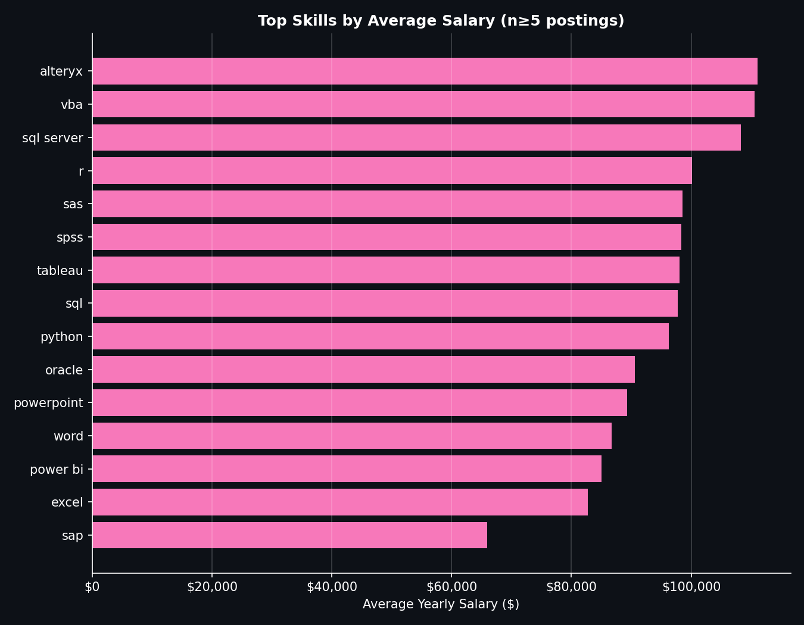
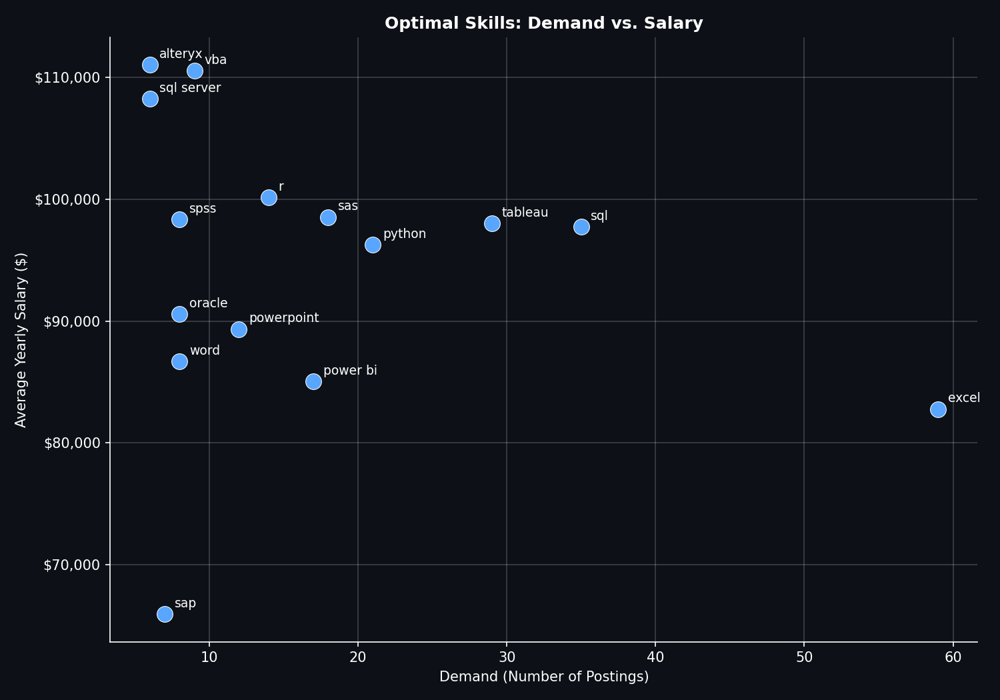

# Introduction
This project analyzes the U.S. job market for **Supply Chain Data Analysts** — roles combining
data analysis skill sets (Data Analyst, Senior Data Analyst, Business Analyst) with core supply
chain functions such as logistics, procurement, sourcing, inventory, transportation, and demand
planning. Using SQL, I explored top-paying roles, in-demand skills, and the skills that offer the
best combination of pay and market demand.

🔍 SQL queries? Check them out here: [project_analysis_sql folder](./project_analysis_sql)

# Background
Supply chain roles that require data analysis skills are often buried inside broader "Data
Analyst" or "Business Analyst" job title searches, making it hard to see what this specific niche
actually pays and demands. This project builds a keyword-based classification filter to isolate
supply-chain-specific analyst postings (logistics, procurement, transportation, inventory, etc.)
from the wider job market, then answers five questions:

1. What are the top-paying Supply Chain Data Analyst jobs?
2. What skills are required for these top-paying jobs?
3. What skills are most in demand for Supply Chain Data Analysts?
4. Which skills are associated with higher salaries?
5. What are the most optimal skills to learn (high demand **and** high pay)?

Data source: job posting dataset covering Data Analyst, Senior Data Analyst, and Business
Analyst roles, filtered to United States postings with disclosed salaries.

# Tools I Used
- **SQL** – core language for querying and extracting insights from the dataset
- **PostgreSQL** – database management system used to host and query the job posting data
- **Visual Studio Code** – SQL development and project management
- **Git & GitHub** – version control and project sharing

# The Analysis
Each query targets a specific angle of the supply chain analyst job market. Job titles were
matched against a curated list of supply-chain-specific keywords (logistics, procurement, sourcing, inventory, transportation, freight, supplier/vendor management, etc.) while explicitly
excluding generic/adjacent terms (ERP/SAP/MRP systems, generic "production" or "quality control")
to keep results function-specific.

### 1. Top-Paying Supply Chain Data Analyst Jobs
Identified the top 20 highest-paying supply chain analyst roles in the U.S.

```sql
SELECT
job_id,
job_title,
job_title_short,
job_location,
job_country,
job_schedule_type,
salary_year_avg,
company_dim.name AS company_name,
job_posted_date
FROM
job_postings_fact
LEFT JOIN company_dim ON job_postings_fact.company_id = company_dim.company_id
WHERE 
job_title_short IN ('Data Analyst', 'Senior Data Analyst', 'Business Analyst')
AND job_country = 'United States'
AND (job_title ILIKE '%supply chain%'
    OR job_title ILIKE '%logistics%'
    OR job_title ILIKE '%procurement%'
    OR job_title ILIKE '%sourcing%'
    OR job_title ILIKE '%inventory%'
    OR job_title ILIKE '%fulfillment%'
    OR job_title ILIKE '%demand planning%'
    OR job_title ILIKE '%supply%operations%'
    OR job_title ILIKE '%vendor management%'
    OR job_title ILIKE '%materials management%'
    OR job_title ILIKE '%demand%planner%'
    OR job_title ILIKE '%demand forecasting%'
    OR job_title ILIKE '%s&op%'
    OR job_title ILIKE '%capacity planning%'
    OR job_title ILIKE '%replenishment%'
    OR job_title ILIKE '%transportation%'
    OR job_title ILIKE '%freight%'
    OR job_title ILIKE '%shipping%'
    OR job_title ~* '\yimport\y'
    OR job_title ~* '\yexport\y'    
    OR job_title ILIKE '%customs%'
    OR job_title ILIKE '%last mile%'
    OR job_title ILIKE '%fleet%'
    OR job_title ILIKE '%production planning%'
    OR job_title ILIKE '%plant operations%'
    OR job_title ILIKE '%lean six sigma%'
    OR job_title ILIKE '%supply chain quality control%'
    OR job_title ILIKE '%purchasing%'
    OR job_title ILIKE '%buyer%'
    OR job_title ILIKE '%category management%'
    OR job_title ILIKE '%strategic sourcing%'
    OR job_title ILIKE '%contract management%'
    OR job_title ILIKE '%supplier%'
    OR job_title ILIKE '%vendor%'
    OR job_title ILIKE '%3pl%'
    OR job_title ILIKE '%third-party logistics%'
    OR job_title ILIKE '%order management%'
    OR job_title ~* '\yport\y')
    AND salary_year_avg IS NOT NULL
    AND job_id NOT IN (993436, 815303, 198826)
ORDER BY
salary_year_avg DESC
LIMIT 20;
```

**Key findings:**
- Salary range: **$112,500 – $175,000**, median around $126,000.
- Top job: *Senior Logistics Data Analyst* at Falconwood, Incorporated ($175,000) — a clear
  outlier, over $29K above the #2 spot.
- Government/defense logistics pays well: US Department of Transportation appeared 4 times
  (all $126,801.5) and Tecolote Research (Navy logistics) twice ($125,000 & $115,000).
- Big-name companies compete for this niche: TikTok ($145,877.5), Home Depot ($125K–$130K),
  Tesla ($115,000).
- Remote work doesn't hurt pay — Ryder System posted the same remote role 3 times across
  different cities, all at $125,000.
- 12 of the top 20 roles are "Senior" level — seniority is the strongest salary lever, followed
  by specialized domain knowledge.


  *Bar graph visualizing the salary for the top 10 salaries for supply chain data analysts; Claude generated this graph from my SQL query results*

### 2. Skills for Top-Paying Jobs
Joined the top 20 jobs from Query 1 against their tagged skills (using a `LEFT JOIN` to keep all
20 jobs even where skills weren't tagged).

```sql
WITH top_paying_jobs AS
(
SELECT
job_id,
job_title,
job_title_short,
salary_year_avg,
company_dim.name AS company_name
FROM
job_postings_fact
LEFT JOIN company_dim ON job_postings_fact.company_id = company_dim.company_id
WHERE 
job_title_short IN ('Data Analyst', 'Senior Data Analyst', 'Business Analyst')
AND job_country = 'United States'
AND (job_title ILIKE '%supply chain%'
    OR job_title ILIKE '%logistics%'
    OR job_title ILIKE '%procurement%'
    OR job_title ILIKE '%sourcing%'
    OR job_title ILIKE '%inventory%'
    OR job_title ILIKE '%fulfillment%'
    OR job_title ILIKE '%demand planning%'
    OR job_title ILIKE '%supply%operations%'
    OR job_title ILIKE '%vendor management%'
    OR job_title ILIKE '%materials management%'
    OR job_title ILIKE '%demand%planner%'
    OR job_title ILIKE '%demand forecasting%'
    OR job_title ILIKE '%s&op%'
    OR job_title ILIKE '%capacity planning%'
    OR job_title ILIKE '%replenishment%'
    OR job_title ILIKE '%transportation%'
    OR job_title ILIKE '%freight%'
    OR job_title ILIKE '%shipping%'
    OR job_title ~* '\yimport\y'
    OR job_title ~* '\yexport\y'    
    OR job_title ILIKE '%customs%'
    OR job_title ILIKE '%last mile%'
    OR job_title ILIKE '%fleet%'
    OR job_title ILIKE '%production planning%'
    OR job_title ILIKE '%plant operations%'
    OR job_title ILIKE '%lean six sigma%'
    OR job_title ILIKE '%supply chain quality control%'
    OR job_title ILIKE '%purchasing%'
    OR job_title ILIKE '%buyer%'
    OR job_title ILIKE '%category management%'
    OR job_title ILIKE '%strategic sourcing%'
    OR job_title ILIKE '%contract management%'
    OR job_title ILIKE '%supplier%'
    OR job_title ILIKE '%vendor%'
    OR job_title ILIKE '%3pl%'
    OR job_title ILIKE '%third-party logistics%'
    OR job_title ILIKE '%order management%'
    OR job_title ~* '\yport\y')
    AND salary_year_avg IS NOT NULL
    AND job_id NOT IN (993436, 815303, 198826)
ORDER BY
salary_year_avg DESC
LIMIT 20
)
SELECT 
    top_paying_jobs.*,
    skills
FROM top_paying_jobs
LEFT JOIN skills_job_dim ON top_paying_jobs.job_id = skills_job_dim.job_id
LEFT JOIN skills_dim ON skills_job_dim.skill_id = skills_dim.skill_id
ORDER BY salary_year_avg DESC;
```

**Key findings:**
- **SQL is the clear baseline skill** — appears in 55% of postings (11/20).
- **Tableau leads visualization**, well ahead of Power BI (35% vs. 10%).
- **Excel, VBA, and Python are tied as secondary skills**, each at 25% (5/20).
- **Alteryx (20%) is a standout supply-chain-specific signal**, likely tied to ETL/data-blending
  workflows common in the domain.
- A long tail of legacy tools (SAS, SPSS, C++, Java, Oracle, MS Access) suggests some
  established companies still carry legacy tech-stack requirements.
- Average ~3.75 skills per posting; 4 of 20 postings (20%) had no tagged skills at all — notably
  all were government/defense logistics titles (Falconwood, Federal Transit Administration,
  Tecolote Research x2).


*Bar graph visualising the count of skills for the top 20 highest paying supply chain data analyst roles; Claude genereated this graph from my SQL query results.*

### 3. Most In-Demand Skills
Counted skill mentions across all qualifying supply chain analyst postings.

``` sql
SELECT 
    skills,
    COUNT (skills_job_dim.job_id) AS demand_count
FROM job_postings_fact
LEFT JOIN skills_job_dim ON job_postings_fact.job_id = skills_job_dim.job_id
LEFT JOIN skills_dim ON skills_job_dim.skill_id = skills_dim.skill_id
WHERE job_title_short IN ('Data Analyst', 'Senior Data Analyst', 'Business Analyst')
    AND job_country = 'United States'
    AND (job_title ILIKE '%supply chain%'
        OR job_title ILIKE '%logistics%'
        OR job_title ILIKE '%procurement%'
        OR job_title ILIKE '%sourcing%'
        OR job_title ILIKE '%inventory%'
        OR job_title ILIKE '%fulfillment%'
        OR job_title ILIKE '%demand planning%'
        OR job_title ILIKE '%supply%operations%'
        OR job_title ILIKE '%vendor management%'
        OR job_title ILIKE '%materials management%'
        OR job_title ILIKE '%demand%planner%'
        OR job_title ILIKE '%demand forecasting%'
        OR job_title ILIKE '%s&op%'
        OR job_title ILIKE '%capacity planning%'
        OR job_title ILIKE '%replenishment%'
        OR job_title ILIKE '%transportation%'
        OR job_title ILIKE '%freight%'
        OR job_title ILIKE '%shipping%'
        OR job_title ~* '\yimport\y'
        OR job_title ~* '\yexport\y'
        OR job_title ILIKE '%customs%'
        OR job_title ILIKE '%last mile%'
        OR job_title ILIKE '%fleet%'
        OR job_title ILIKE '%production planning%'
        OR job_title ILIKE '%plant operations%'
        OR job_title ILIKE '%lean six sigma%'
        OR job_title ILIKE '%supply chain quality control%'
        OR job_title ILIKE '%purchasing%'
        OR job_title ILIKE '%buyer%'
        OR job_title ILIKE '%category management%'
        OR job_title ILIKE '%strategic sourcing%'
        OR job_title ILIKE '%contract management%'
        OR job_title ILIKE '%supplier%'
        OR job_title ILIKE '%vendor%'
        OR job_title ILIKE '%3pl%'
        OR job_title ILIKE '%third-party logistics%'
        OR job_title ILIKE '%order management%'
        OR job_title ~* '\yport\y')
        AND job_postings_fact.job_id NOT IN (993436, 815303, 198826)
GROUP BY skills_dim.skills
ORDER BY demand_count DESC
LIMIT 10;
```

**Key findings:**
- **Excel is the single most in-demand skill by a wide margin** — 769 mentions, 57% more than
  SQL (490), the #2 skill.
- **SQL is the clear #2** and top technical/database skill, ~1.6x more in-demand than Tableau (345).
- **Tableau leads Power BI** — 345 vs. 280 mentions (~23% more demand).
- **Python (255) and SAP (249) are nearly tied**, despite one being a general-purpose language and
  the other a domain-specific ERP system.
- **PowerPoint (213) and Word (200)** both crack the top 10 — a reminder these roles expect real
  reporting/communication deliverables, not just backend data work.
- Full hierarchy: Excel → SQL → Tableau → Power BI → Python ≈ SAP → PowerPoint → Word → R → VBA.


*Bar graph visualising the top 10 most in-demand skills across all qualifying supply chain data analyst postings; Claude generated this graph from my SQL query results.*

### 4. Top Skills Based on Salary
Averaged salary per skill (with `HAVING COUNT >= 5` to filter out small-sample noise).

```sql
SELECT 
    skills,
    ROUND(AVG(salary_year_avg), 0) AS avg_salaries,
    COUNT(skills_job_dim.job_id) AS job_count
FROM job_postings_fact
INNER JOIN skills_job_dim ON job_postings_fact.job_id = skills_job_dim.job_id
INNER JOIN skills_dim ON skills_job_dim.skill_id = skills_dim.skill_id
WHERE
    salary_year_avg IS NOT NULL
    AND job_title_short IN ('Data Analyst', 'Senior Data Analyst', 'Business Analyst')
    AND job_country = 'United States'
    AND (job_title ILIKE '%supply chain%'
        OR job_title ILIKE '%logistics%'
        OR job_title ILIKE '%procurement%'
        OR job_title ILIKE '%sourcing%'
        OR job_title ILIKE '%inventory%'
        OR job_title ILIKE '%fulfillment%'
        OR job_title ILIKE '%demand planning%'
        OR job_title ILIKE '%supply%operations%'
        OR job_title ILIKE '%vendor management%'
        OR job_title ILIKE '%materials management%'
        OR job_title ILIKE '%demand%planner%'
        OR job_title ILIKE '%demand forecasting%'
        OR job_title ILIKE '%s&op%'
        OR job_title ILIKE '%capacity planning%'
        OR job_title ILIKE '%replenishment%'
        OR job_title ILIKE '%transportation%'
        OR job_title ILIKE '%freight%'
        OR job_title ILIKE '%shipping%'
        OR job_title ~* '\yimport\y'
        OR job_title ~* '\yexport\y'
        OR job_title ILIKE '%customs%'
        OR job_title ILIKE '%last mile%'
        OR job_title ILIKE '%fleet%'
        OR job_title ILIKE '%production planning%'
        OR job_title ILIKE '%plant operations%'
        OR job_title ILIKE '%lean six sigma%'
        OR job_title ILIKE '%supply chain quality control%'
        OR job_title ILIKE '%purchasing%'
        OR job_title ILIKE '%buyer%'
        OR job_title ILIKE '%category management%'
        OR job_title ILIKE '%strategic sourcing%'
        OR job_title ILIKE '%contract management%'
        OR job_title ILIKE '%supplier%'
        OR job_title ILIKE '%vendor%'
        OR job_title ILIKE '%3pl%'
        OR job_title ILIKE '%third-party logistics%'
        OR job_title ILIKE '%order management%'
        OR job_title ~* '\yport\y')
    AND job_postings_fact.job_id NOT IN (993436, 815303, 198826)
GROUP BY
    skills
HAVING
COUNT(skills_job_dim.job_id) >= 5
ORDER BY
    avg_salaries DESC
LIMIT 25;
```

**Key findings:**
- 15 skills passed the threshold, ranging from **Alteryx ($111,039, n=6)** down to **SAP
  ($65,929, n=7)**.
- **Demand and pay don't move together**: Excel is the most in-demand skill overall (59
  postings) but sits near the bottom of the pay range ($82,758) — a baseline expectation, not
  a differentiator.
- **Alteryx, VBA, SQL Server, and R** — specialized manipulation/automation/stats tools — command
  a clear pay premium despite far lower posting counts.
- **SAP, despite being supply-chain-specific ERP software, is the lowest-paying skill** in the
  qualifying list — suggesting it's table-stakes rather than a differentiator.
- *Caveat:* skills with n=5–7 (Alteryx, SAP, SQL Server) carry more uncertainty than
  higher-volume skills (SQL n=35, Excel n=59, Tableau n=29).


*Bar graph visaulising average salary by skill (n>5 postings) for supply chain data analyst roles; Claude generated this graph from my SQL results.*

### 5. Most Optimal Skills to Learn
Combined demand and average salary to find skills that are both frequently requested **and**
well-paid.

``` sql
WITH skills_demand AS (
    SELECT
        skills_dim.skill_id, 
        skills_dim.skills,
        COUNT (skills_job_dim.job_id) AS demand_count
    FROM job_postings_fact
    LEFT JOIN skills_job_dim ON job_postings_fact.job_id = skills_job_dim.job_id
    LEFT JOIN skills_dim ON skills_job_dim.skill_id = skills_dim.skill_id
    WHERE 
        salary_year_avg IS NOT NULL
        AND job_title_short IN ('Data Analyst', 'Senior Data Analyst', 'Business Analyst')
        AND job_country = 'United States'
        AND (job_title ILIKE '%supply chain%'
            OR job_title ILIKE '%logistics%'
            OR job_title ILIKE '%procurement%'
            OR job_title ILIKE '%sourcing%'
            OR job_title ILIKE '%inventory%'
            OR job_title ILIKE '%fulfillment%'
            OR job_title ILIKE '%demand planning%'
            OR job_title ILIKE '%supply%operations%'
            OR job_title ILIKE '%vendor management%'
            OR job_title ILIKE '%materials management%'
            OR job_title ILIKE '%demand%planner%'
            OR job_title ILIKE '%demand forecasting%'
            OR job_title ILIKE '%s&op%'
            OR job_title ILIKE '%capacity planning%'
            OR job_title ILIKE '%replenishment%'
            OR job_title ILIKE '%transportation%'
            OR job_title ILIKE '%freight%'
            OR job_title ILIKE '%shipping%'
            OR job_title ~* '\yimport\y'
            OR job_title ~* '\yexport\y'
            OR job_title ILIKE '%customs%'
            OR job_title ILIKE '%last mile%'
            OR job_title ILIKE '%fleet%'
            OR job_title ILIKE '%production planning%'
            OR job_title ILIKE '%plant operations%'
            OR job_title ILIKE '%lean six sigma%'
            OR job_title ILIKE '%supply chain quality control%'
            OR job_title ILIKE '%purchasing%'
            OR job_title ILIKE '%buyer%'
            OR job_title ILIKE '%category management%'
            OR job_title ILIKE '%strategic sourcing%'
            OR job_title ILIKE '%contract management%'
            OR job_title ILIKE '%supplier%'
            OR job_title ILIKE '%vendor%'
            OR job_title ILIKE '%3pl%'
            OR job_title ILIKE '%third-party logistics%'
            OR job_title ILIKE '%order management%'
            OR job_title ~* '\yport\y')
            AND job_postings_fact.job_id NOT IN (993436, 815303, 198826)
    GROUP BY skills_dim.skill_id
),  avg_salaries AS (
    SELECT 
        skills_job_dim.skill_id,
        ROUND(AVG(salary_year_avg), 0) AS avg_salaries,
        COUNT(skills_job_dim.job_id) AS job_count
    FROM job_postings_fact
    INNER JOIN skills_job_dim ON job_postings_fact.job_id = skills_job_dim.job_id
    INNER JOIN skills_dim ON skills_job_dim.skill_id = skills_dim.skill_id
    WHERE
        salary_year_avg IS NOT NULL
        AND job_title_short IN ('Data Analyst', 'Senior Data Analyst', 'Business Analyst')
        AND job_country = 'United States'
        AND (job_title ILIKE '%supply chain%'
            OR job_title ILIKE '%logistics%'
            OR job_title ILIKE '%procurement%'
            OR job_title ILIKE '%sourcing%'
            OR job_title ILIKE '%inventory%'
            OR job_title ILIKE '%fulfillment%'
            OR job_title ILIKE '%demand planning%'
            OR job_title ILIKE '%supply%operations%'
            OR job_title ILIKE '%vendor management%'
            OR job_title ILIKE '%materials management%'
            OR job_title ILIKE '%demand%planner%'
            OR job_title ILIKE '%demand forecasting%'
            OR job_title ILIKE '%s&op%'
            OR job_title ILIKE '%capacity planning%'
            OR job_title ILIKE '%replenishment%'
            OR job_title ILIKE '%transportation%'
            OR job_title ILIKE '%freight%'
            OR job_title ILIKE '%shipping%'
            OR job_title ~* '\yimport\y'
            OR job_title ~* '\yexport\y'
            OR job_title ILIKE '%customs%'
            OR job_title ILIKE '%last mile%'
            OR job_title ILIKE '%fleet%'
            OR job_title ILIKE '%production planning%'
            OR job_title ILIKE '%plant operations%'
            OR job_title ILIKE '%lean six sigma%'
            OR job_title ILIKE '%supply chain quality control%'
            OR job_title ILIKE '%purchasing%'
            OR job_title ILIKE '%buyer%'
            OR job_title ILIKE '%category management%'
            OR job_title ILIKE '%strategic sourcing%'
            OR job_title ILIKE '%contract management%'
            OR job_title ILIKE '%supplier%'
            OR job_title ILIKE '%vendor%'
            OR job_title ILIKE '%3pl%'
            OR job_title ILIKE '%third-party logistics%'
            OR job_title ILIKE '%order management%'
            OR job_title ~* '\yport\y')
        AND job_postings_fact.job_id NOT IN (993436, 815303, 198826)
    GROUP BY
        skills_job_dim.skill_id
    HAVING
    COUNT(skills_job_dim.job_id) >= 5 
)
SELECT
    skills_demand.skill_id,
    skills_demand.skills,
    demand_count,
    avg_salaries.avg_salaries
FROM
    skills_demand
INNER JOIN avg_salaries ON skills_demand.skill_id = avg_salaries.skill_id
ORDER BY
    avg_salaries DESC,
    demand_count DESC
```

**Key findings:**
- **SQL is the standout optimal skill**: high demand (35 postings, 2nd-highest) and strong pay
  ($97,749, above the group median).
- **Tableau is the next-best balance**: 29 postings (3rd-highest demand) at $98,003 — nearly
  tied with SQL on pay.
- **Python (21 postings, $96,268)** rounds out the top tier — solid on both axes.
- **Alteryx, VBA, and SQL Server** sit at the top of the salary list ($108K–$111K) but rank near
  the bottom on demand (6–9 postings) — high reward, smaller bet.
- **Excel and Power BI** trade high demand for middling pay — read as "expected baseline," not a
  differentiator.
- **SAP is the clear outlier to avoid over-indexing on**: lowest pay and modest demand — weak on
  both axes.
- *Data quirk:* "sas" appears under two different `skill_id`s in the source data, both with
  identical demand (9) and salary ($98,528) — treated as one skill (combined n=18) in analysis,
  not two.


*Scatter plot visualising demand vs. average salary for each skill, highlighting the most optimal skills to learn for supply chain data analyst roles; Claude generated this graph from my SQL query results.*

# What I Learned

Throughout this project, I sharpened my SQL toolkit while untangling a messy, real-world dataset:

- **🔍 Keyword-Based Classification:** Built and refined a multi-keyword `ILIKE`/regex filter to isolate
  supply-chain-specific job titles from a much broader dataset — learned how to scope search terms
  tightly enough to stay function-specific without pulling in unrelated roles.
- **🧩 Advanced Query Crafting:** Leveled up with CTEs (`WITH` clauses) to chain multi-step logic —
  like joining a "top 20 jobs" subquery to skill data in Query 2, and combining separate demand and
  salary CTEs into one final answer in Query 5.
- **⚖️ JOIN Strategy Matters:** Learned how `LEFT JOIN` vs. `INNER JOIN` changes results — `LEFT JOIN`
  preserved every job posting even when skills were untagged, while `INNER JOIN` correctly excluded
  them when averaging salary by skill.
- **📊 Aggregation & Grouping:** Got comfortable with `GROUP BY`, `COUNT()`, and `AVG()` to turn raw
  postings into skill-level insights — demand counts, average salaries, and combined rankings.
- **🎯 Sample-Size Awareness:** Using `HAVING COUNT(...) >= 5` in Query 4 was essential — without it,
  skills mentioned in only 1–2 postings floated to the top purely from noise, not genuine signal.
- **⚡ Demand vs. Pay Are Independent:** The most in-demand skill (Excel) is one of the lowest-paid,
  while some of the highest-paid skills (Alteryx, SQL Server) have relatively low demand — "optimal"
  skills require balancing both, not chasing either alone.
- **🐛 Data Quality Debugging:** Catching "sas" duplicated across two `skill_id`s in Query 5 was a
  reminder to sanity-check aggregated results rather than trust them blindly.
  
# Conclusions

### Insights
From the analysis, several general insights emerged:

1. **Top-Paying Supply Chain Data Analyst Jobs**: The highest-paying roles in this niche range from
   $112,500 to $175,000, with "Senior" titles and government/defense-adjacent logistics roles forming
   the strongest concentration of high earners.
2. **Skills for Top-Paying Jobs**: High-paying supply chain analyst roles consistently require SQL
   (55% of postings), making it the clearest baseline skill for landing a top-paying role.
3. **Most In-Demand Skills**: Excel is the single most requested skill across all postings (769
   mentions), well ahead of SQL (490) — spreadsheet fluency remains the universal expectation in
   this field.
4. **Skills with Higher Salaries**: Specialized tools like Alteryx, VBA, and SQL Server command a
   clear pay premium ($108K–$111K average) despite lower overall demand, indicating a premium on
   niche expertise over broad, general-purpose skills.
5. **Optimal Skills for Job Market Value**: SQL and Tableau strike the best balance of high demand
   and high pay, positioning them as the most optimal skills for supply chain data analysts looking
   to maximize their market value.

### Closing Thoughts
This project sharpened my SQL skills while providing real insight into the supply chain data analyst
job market. The findings serve as a guide for prioritizing which skills to develop and where to focus
a job search — favoring SQL and Tableau as reliable, high-value foundations, while treating niche
tools like Alteryx as a smaller, higher-reward bet. This project also reinforced how much classifying
messy, real-world job title data accurately — and validating results carefully — shapes the quality
of the insights you can draw from it.  

# Takeaway
For anyone targeting a Supply Chain Data Analyst role in the U.S., the data points to a clear
strategy: **SQL, Tableau, and Excel form the non-negotiable foundation** (highest combined demand
and reliability), while **Alteryx, VBA, and SQL Server offer a real pay premium** for those
willing to specialize in a narrower, higher-paying niche. Seniority remains the single strongest
lever for salary growth, and government/defense-adjacent logistics roles form a notable
high-paying cluster worth watching for job seekers in this space.